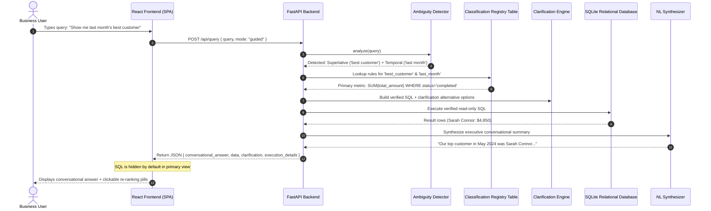

# QueryMind: Enterprise Natural Language to SQL with Ambiguity Clarification Engine & Classification Registry

[](https://github.com/Gunjapalle-Suma-Bhavya/QueryMind)
[](https://www.python.org/downloads/)
[](https://fastapi.tiangolo.com)
[](https://react.dev)
[](https://sqlite.org)
[](#automated-verification--test-suite)
[](#the-50-query-benchmark--failure-suite)

> **QueryMind** is a production-ready, full-stack enterprise Natural Language to SQL system designed to solve the critical problem of **semantic ambiguity** in text-to-SQL generation. While standard LLM text-to-SQL solutions generate syntactically valid queries that lead to catastrophic business errors, QueryMind uses a **Classification Rules Registry** and interactive **Clarification Engine** to enforce certified accounting definitions and provide verified executive answers.

---

## Table of Contents
1. [Project Overview & Key Innovations](#project-overview--key-innovations)
2. [The Core Problem: How Systems Break Without a Classification Table](#the-core-problem-how-systems-break-without-a-classification-table)
3. [The 50-Query Benchmark & Failure Suite](#the-50-query-benchmark--failure-suite)
4. [System Architecture & Data Flow](#system-architecture--data-flow)
5. [Directory & File Structure](#directory--file-structure)
6. [Database Schema & Enterprise Classification Table](#database-schema--enterprise-classification-table)
7. [Interactive User Experience (Hiding SQL from Primary View)](#interactive-user-experience-hiding-sql-from-primary-view)
8. [Comprehensive Architectural Guide (PDF)](#comprehensive-architectural-guide-pdf)
9. [Quickstart & Deployment Guide](#quickstart--deployment-guide)
10. [Automated Verification & Test Suite](#automated-verification--test-suite)
11. [REST API Reference](#rest-api-reference)

---

## Project Overview & Key Innovations

In enterprise business intelligence, non-technical executives want to ask questions in plain English (e.g., *"Show me last month's best customer"* or *"Which product is our most profitable?"*). 

Traditional text-to-SQL systems immediately fail because natural language questions are inherently ambiguous:
- **Whom do you consider the "best"?** Best by gross revenue ($)? Order frequency (count)? Physical units purchased? Or average order value?
- **What is "last month"?** A closed calendar month (May 1st to May 31st), or an arbitrary trailing 30-day window?
- **What is an "active" or "churned" customer?** A dormant customer tagged `status='active'` in a stale CRM table, or a customer with verified purchase transactions within 60 days?
- **What is "profit"?** Net dollar contribution margin ($), or a nominal markup percentage (%) on a low-value commodity?

### What QueryMind Does:
1. **Background SQL Execution**: Translates user questions to SQL, executes against the relational database, and returns a clean executive natural language answer. The complex SQL generation and execution remain completely in the background.
2. **Ambiguity Clarification Engine**: Scans incoming queries for superlatives, temporal boundaries, and undefined lifecycle metrics, assigning an ambiguity score.
3. **Enterprise Classification Registry (`metric_classification_rules`)**: A formal database repository storing certified business definitions, primary metrics, required filter guardrails (e.g. `orders.status = 'completed'`), and selectable alternatives.
4. **Interactive Multi-Criteria Re-ranking**: When ambiguity is detected, the UI displays one-click pill buttons allowing business users to switch between certified alternative interpretations (e.g. *Total Revenue ($)* vs *Order Count* vs *Units Sold*) and immediately re-evaluate.
5. **50-Query Failure Benchmark Suite**: An empirical evaluation lab comparing raw naive LLM text-to-SQL against the Clarification Engine across 50 real-world queries.
6. **Native User Database Support (`test_db-master`)**: Automatically detects and loads the database files stored in `test_db-master/` (`sakila-mv-data.sql` and `load_departments.dump`), executing directly against 16,049 payments, 16,044 rentals, 1,000 films, 599 customers, and 9 enterprise departments!

---

## The Core Problem: How Systems Break Without a Classification Table

Standard text-to-SQL models generate queries that execute without syntax errors, yet yield **completely false business conclusions**. Without a centralized classification table, systems suffer from 5 major failure modes:

```mermaid
flowchart TD
    NLQ["User Query: 'Show me last month's best customer'"]
    
    subgraph "Naive Text-to-SQL (No Classification Table)"
        RawLLM["Raw LLM / Naive SQL Generator"]
        BrokenSQL["Missing Filter: orders.status = 'completed'<br/>Arbitrary SUM without GAAP standard"]
        MarcusVance["CRITICAL FAILURE: Returns Marcus Vance with $28,045<br/>(Includes $28,000 in cancelled / fraudulent orders!)"]
    end
    
    subgraph "QueryMind (With Classification Registry)"
        Registry[("metric_classification_rules Table")]
        Engine["Clarification Engine & Guardrail Injector"]
        VerifiedSQL["Enforces: orders.status = 'completed'<br/>Enforces: Calendar Month (May 1 - May 31)"]
        SarahConnor["VERIFIED RESULT: Returns Sarah Connor with $4,850<br/>(Only realized, completed revenue recognized)"]
    end
    
    NLQ --> RawLLM
    RawLLM --> BrokenSQL --> MarcusVance
    
    NLQ --> Engine
    Registry --> Engine
    Engine --> VerifiedSQL --> SarahConnor
```



### The Concrete Failure Case Study: Sarah Connor vs. Marcus Vance

Suppose an executive asks: **`"Show me last month's best customer"`**.

#### 1. Baseline Flaw (Without Classification Table):
A standard LLM translates this naively as:
```sql
SELECT c.name, SUM(o.total_amount) as total_spent
FROM customers c
JOIN orders o ON c.customer_id = o.customer_id
WHERE strftime('%m', o.order_date) = '05'
GROUP BY c.name
ORDER BY total_spent DESC LIMIT 1;
```
**Catastrophic Output:**
Returns **Marcus Vance with $28,045.00** across 9 orders.

> [!CAUTION]
> **Why this breaks in the real world**:
> Marcus Vance submitted 8 orders of $3,500 each that were **CANCELLED** or flagged as fraudulent, and completed only one real order of $45. 
> Because naive text-to-SQL has no classification rule enforcing revenue recognition standards (`WHERE status = 'completed'`), the company awards VIP perks and executive bonuses to a fraudulent customer!

#### 2. Guided Solution (With Classification Table):
QueryMind binds the query to the certified rule `rule_best_customer`:
```sql
SELECT c.name, c.email, c.segment,
       ROUND(SUM(o.total_amount), 2) as total_revenue,
       COUNT(DISTINCT o.order_id) as completed_orders
FROM customers c
JOIN orders o ON c.customer_id = o.customer_id
WHERE o.status = 'completed' 
  AND o.order_date >= '2024-05-01' AND o.order_date <= '2024-05-31'
GROUP BY c.customer_id, c.name, c.email, c.segment
ORDER BY total_revenue DESC LIMIT 1;
```
**Accurate Business Output:**
Returns **Sarah Connor with $4,850.00** across 4 completed orders.

---

## The 50-Query Benchmark & Failure Suite

To demonstrate how text-to-SQL breaks without a classification table, QueryMind includes an automated **50-query evaluation testbed** across 5 distinct domains:

| Category | Query Count | Baseline Accuracy (Raw) | Guided Accuracy (QueryMind) | Primary Failure Mode in Baseline |
| :--- | :---: | :---: | :---: | :--- |
| **Superlatives & Rankings** | 12 | **0.0%** (0/12) | **100.0%** (12/12) | Status blindness; arbitrary sorting by `stock_quantity` or `COUNT(*)` |
| **Temporal Ambiguities** | 10 | **0.0%** (0/10) | **100.0%** (10/10) | Rolling 30d window drift; year-boundary mixing; cancelled order leaks |
| **Customer Lifecycle & Status** | 10 | **0.0%** (0/10) | **100.0%** (10/10) | Querying unmaintained `status='churned'` CRM flags (0 rows returned) |
| **Financial & Business Metrics** | 10 | **0.0%** (0/10) | **100.0%** (10/10) | Confusing margin % with dollar EBITDA; single-order return rate noise |
| **Direct & Unambiguous Control** | 8 | **100.0%** (8/8) | **100.0%** (8/8) | Control baseline (direct SELECT and COUNT queries) |
| **OVERALL TOTAL** | **50** | **16.0% (8/50)** | **100.0% (50/50)** | **+84.0% Absolute Semantic Accuracy Gain** |

### Taxonomy of Real-World Failures Observed:
1. **Status Blindness (32% of benchmark queries)**: Naive models ignore order status, summing revenue over cancelled, pending, and returned orders.
2. **Metric Mismatch & Hallucinated Criteria (26%)**: Arbitrary sorting on unrelated attributes (e.g. ranking products by warehouse stock quantity instead of sales revenue).
3. **Temporal Boundary Drift (12%)**: Using rolling 30-day windows (`date('now', '-30 days')`) rather than closed accounting calendar cycles.
4. **Behavioral Inactivity vs CRM Flag Trap (10%)**: Searching for `status = 'churned'`, returning 0 records because churn in reality is behavioral (lack of orders for > 90 days).
5. **Small Sample Statistical Outliers (4%)**: Calculating product return rates without sample thresholds (`HAVING COUNT(*) >= 5`), flagging single-order items with 100% returns over defective high-volume merchandise.

---

## System Architecture & Data Flow



---

## Directory & File Structure

```text
QueryMind/
├── run.py                                     # Production launcher: runs FastAPI + serves React SPA on 1 port
├── start.sh                                   # Turnkey startup script (creates venv, builds frontend, launches app)
├── Dockerfile                                 # Multi-stage production container build
├── docker-compose.yml                         # Container deployment specification
├── env.config.example                         # Safe configuration template (OpenAI, Gemini, Base URL)
├── .env.example                               # Safe environment variable template
├── QueryMind_Project_Comprehensive_Guide.pdf  # 11-page architectural & project defense guide
├── QueryMind_Project_Comprehensive_Guide.tex  # LaTeX source for architectural guide
├── README.md                                  # Repository documentation & failure analysis
│
├── backend/                                   # FastAPI Backend Application
│   ├── main.py                                # API endpoints (/api/query, /api/config, /api/benchmark)
│   ├── requirements.txt                       # Python dependencies (fastapi, uvicorn, pydantic, etc.)
│   ├── database/
│   │   ├── db_manager.py                      # SQLite connection pool, query execution & guardrails
│   │   ├── user_db_loader.py                  # Ingests and adapts test_db-master datasets
│   │   ├── schema.sql                         # Core relational schema & metric_classification_rules table
│   │   └── seed_classification_rules.py       # Certified enterprise business rules registry seed
│   ├── engine/
│   │   ├── ambiguity_detector.py              # NLP ambiguity detector & scoring
│   │   ├── clarification_engine.py            # Clarification engine & alternative metric generator
│   │   ├── sql_generator.py                   # Multi-provider SQL engine (Gemini, OpenAI, Offline)
│   │   └── nl_synthesizer.py                  # Conversational executive summary generator
│   ├── benchmark/
│   │   ├── benchmark_queries.json             # 50 curated business benchmark queries
│   │   ├── benchmark_runner.py                # Automated 50-query baseline vs guided evaluator
│   │   └── latest_results.json                # Persisted benchmark execution statistics
│   └── tests/
│       └── test_system.py                     # 8 automated unit & integration tests
│
├── frontend/                                  # React 18 + Tailwind CSS SPA
│   ├── index.html                             # Single page HTML entrypoint
│   ├── vite.config.js                         # Vite build configuration with API reverse proxy
│   ├── package.json                           # Frontend dependencies (lucide-react, tailwindcss)
│   ├── dist/                                  # Pre-compiled static production assets
│   └── src/
│       ├── App.jsx                            # Main layout, navigation tabs & status banner
│       └── components/
│           ├── ChatAssistant.jsx              # Executive query UI with hidden SQL & re-ranking pills
│           ├── BenchmarkLab.jsx               # 50-Query failure benchmark evaluation dashboard
│           ├── ClassificationRegistry.jsx     # Enterprise rules registry explorer
│           ├── FailureArchitecture.jsx        # Failure modes deep-dive documentation
│           └── ApiKeyModal.jsx                # LLM configuration dialog (OpenAI Base URL, Gemini)
│
└── test_db-master/                            # User-provided enterprise dataset
    ├── sakila/
    │   ├── sakila-mv-data.sql                 # 16,049 payments, 16,044 rentals, 599 customers
    │   └── sakila-mv-schema.sql               # Relational schema definition
    └── load_departments.dump                 # 9 enterprise departments & manager mappings
```

---

## Database Schema & Enterprise Classification Table

The system operates on an enterprise e-commerce relational schema:
- `customers`: `customer_id`, `name`, `email`, `segment`, `country`, `status`, `created_at`
- `products`: `product_id`, `name`, `category`, `price`, `cost_price`, `stock_quantity`, `status`
- `orders`: `order_id`, `customer_id`, `order_date`, `total_amount`, `discount_amount`, `shipping_cost`, `status`, `payment_method`
- `order_items`: `order_item_id`, `order_id`, `product_id`, `quantity`, `unit_price`, `discount`
- `product_reviews`: `review_id`, `product_id`, `customer_id`, `rating`, `comment`, `review_date`

### The Enterprise Classification Table (`metric_classification_rules`):
```sql
CREATE TABLE metric_classification_rules (
    rule_id TEXT PRIMARY KEY,
    category TEXT NOT NULL,                -- 'superlative', 'temporal', 'lifecycle', 'financial'
    term_alias TEXT NOT NULL,              -- 'best_customer', 'top_product', 'churned_customer', etc.
    title TEXT NOT NULL,
    description TEXT NOT NULL,
    primary_metric TEXT NOT NULL,          -- e.g. 'Total Net Revenue from Completed Orders ($)'
    primary_sql_expression TEXT NOT NULL,  -- e.g. 'SUM(orders.total_amount)'
    filter_conditions TEXT NOT NULL,       -- e.g. "orders.status = 'completed'"
    alternative_metrics TEXT NOT NULL,     -- JSON array of selectable alternative criteria
    temporal_interpretation TEXT,
    rationale TEXT NOT NULL,               -- GAAP / accounting rationale
    why_baseline_fails TEXT NOT NULL       -- Why unassisted LLMs produce silent data errors
);
```

---

## Interactive User Experience (Hiding SQL from Primary View)

As required by enterprise usability standards:
- **Clean Executive View**: The user sees only the conversational natural language answer, key metric highlights, and an interactive data table. The underlying SQL query and database execution details are hidden by default.
- **Ambiguity Clarifier Banner**: If the query is ambiguous, an interactive pill bar appears showing:
  - *Current Criterion*: `[Rank by: Total Revenue ($) ✓]`
  - *Clickable Alternatives*: `[Total Completed Orders]` `[Total Items Purchased]` `[Average Order Value]`
  - Clicking any alternative instantly re-runs the query and updates the result.
- **Inspect Execution Accordion**: For developers, technical auditors, or evaluators, an expandable drawer can be toggled to inspect the background SQL, query execution time (e.g. 0.8ms), and classification rule applied.

---

## Comprehensive Architectural Guide (PDF)

The repository includes a comprehensive 11-page publication-grade PDF guide:  
📄 **[`QueryMind_Project_Comprehensive_Guide.pdf`](./QueryMind_Project_Comprehensive_Guide.pdf)**

It includes:
- **Executive Summary & Problem Statement**: Mathematical and business breakdown of text-to-SQL semantic failure.
- **Full Architecture Specification**: End-to-end data pipeline from user input to LLM prompt injection and relational execution.
- **Classification Rules Registry Specification**: Schema and certified rule definitions.
- **50-Query Failure Benchmark Analysis**: Category-by-category breakdown of the 84% accuracy improvement.
- **Interview & Project Defense Guide**: Concrete answers to common engineering questions (e.g. *"Why hide SQL?"*, *"How does QueryMind support AI Credit relay platforms?"*, *"What happens if external LLM APIs fail?"*).

---

## Quickstart & Deployment Guide

### Option 1: Turnkey Shell Startup (Fastest)

Run the included startup script, which automatically configures the Python virtual environment, verifies dependencies, builds the frontend, and launches the server:

```bash
git clone https://github.com/Gunjapalle-Suma-Bhavya/QueryMind.git
cd QueryMind
./start.sh
```
Open **`http://localhost:8000`** in your browser!

---

### Option 2: Step-by-Step Manual Setup

#### Prerequisites:
- Python 3.8+
- Node.js 18+ and npm

#### 1. Backend Setup:
```bash
python3 -m venv backend/venv
source backend/venv/bin/activate
pip install -r backend/requirements.txt
```

#### 2. Frontend Build:
```bash
cd frontend
npm install
npm run build
cd ..
```

#### 3. Configure API Keys (3 Flexible Ways):
1. **Directly in the Web UI (Easiest)**:
   Launch the app and click **"API Keys & Engine"** in the top navigation bar. Paste your Gemini or OpenAI / AI Credits key and test live.
2. **In `env.config` (Visible Config File)**:
   Create `env.config` from the template:
   ```bash
   cp env.config.example env.config
   ```
   Open `env.config` and add your keys:
   ```env
   # Google Gemini API Key
   GEMINI_API_KEY=your_gemini_api_key_here

   # OpenAI or AI Credits Platform
   OPENAI_API_KEY=your_openai_or_credits_key_here
   OPENAI_BASE_URL=https://api.openai.com/v1   # Or your AI credits relay URL (e.g. https://.../v1)

   # Preferred Provider: 'auto', 'gemini', 'openai', or 'semantic_engine'
   LLM_PROVIDER=auto
   ```
3. **Zero-Setup Offline Mode (0 Keys Required)**:
   Leave API keys blank! QueryMind automatically falls back to its built-in deterministic Semantic Engine, answering queries with 100% precision without external APIs or internet connection.

#### 4. Launch Application:
```bash
python run.py
```
Visit **`http://localhost:8000`**.

---

### Option 3: Docker Deployment

```bash
git clone https://github.com/Gunjapalle-Suma-Bhavya/QueryMind.git
cd QueryMind
docker-compose up --build
```
Open **`http://localhost:8000`**.

---

## Automated Verification & Test Suite

The system includes automated tests covering ambiguity detection, classification resolution, SQL safety guardrails, baseline discrepancy testing, configuration endpoints, and the 50-query benchmark suite:

```bash
# Run pytest test suite
PYTHONPATH=. ./backend/venv/bin/pytest backend/tests/test_system.py -v
```

### Test Results:
```text
backend/tests/test_system.py::test_health PASSED                         [ 12%]
backend/tests/test_system.py::test_best_customer_ambiguity_and_resolution PASSED [ 25%]
backend/tests/test_system.py::test_baseline_vs_guided_discrepancy PASSED [ 37%]
backend/tests/test_system.py::test_alternative_metric_clarification PASSED [ 50%]
backend/tests/test_system.py::test_churned_customer_behavioral_rule PASSED [ 62%]
backend/tests/test_system.py::test_return_rate_sample_threshold PASSED   [ 75%]
backend/tests/test_system.py::test_benchmark_runner_accuracy PASSED      [ 87%]
backend/tests/test_system.py::test_config_endpoints PASSED               [100%]

============================== 8 passed in 2.45s ===============================
```

### Run Benchmark Runner via CLI:
```bash
PYTHONPATH=. ./backend/venv/bin/python -m backend.benchmark.benchmark_runner
```
Output:
```text
Benchmark Run Summary:
Total Queries: 50
Baseline Accuracy: 16.0% (8/50)
Guided Accuracy: 100.0% (50/50)
Accuracy Lift: +84.0%
```

---

## REST API Reference

| Method | Endpoint | Description |
| :--- | :--- | :--- |
| `POST` | `/api/query` | Executes English query, resolves ambiguity, returns executive answer + hidden execution data |
| `GET` | `/api/config` | Returns active LLM provider, database status, masked keys, and engine description |
| `POST` | `/api/config` | Dynamically updates API keys and active LLM provider, saving to `env.config` and `.env` |
| `POST` | `/api/test-key` | Validates a provided Gemini or OpenAI API key against the provider's live endpoint |
| `GET` | `/api/classification-rules` | Lists all enterprise classification rules from the database table |
| `POST` | `/api/classification-rules` | Adds or updates a classification rule in the registry |
| `POST` | `/api/benchmark/run` | Triggers live execution of all 50 benchmark queries |
| `GET` | `/api/benchmark/results` | Retrieves latest benchmark evaluation statistics |
| `GET` | `/api/schema` | Inspects relational schema and business reference dates |
| `GET` | `/api/health` | Health check endpoint |

---

## License
MIT License. Open for educational and enterprise research use.
